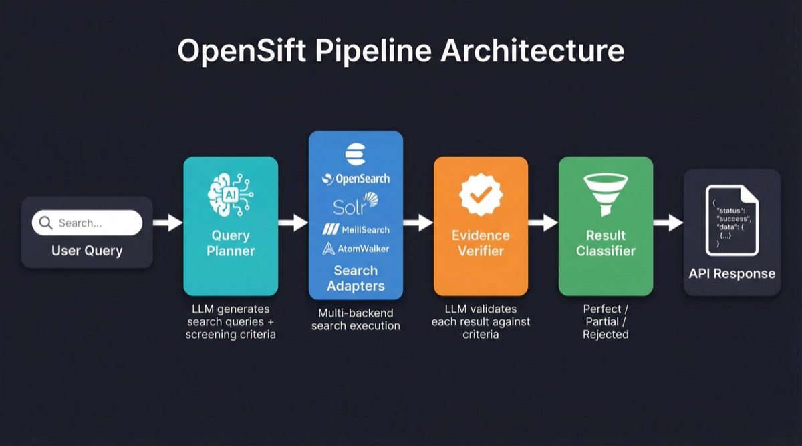

<p align="center">
  
</p>

<p align="center">
  <a href="https://github.com/opensift/opensift/blob/main/LICENSE"></a>
  <a href="https://www.python.org/downloads/"></a>
  <a href="https://github.com/opensift/opensift"></a>
  <a href="https://github.com/astral-sh/ruff"></a>
  <a href="https://github.com/opensift/opensift"></a>
</p>

<p align="center">
  <b><a href="README.md">English</a> | <a href="README_zh.md">中文</a></b>
</p>

**Open-source AI augmentation layer that adds intelligent query planning and result verification to any search backend.**

OpenSift is not a search engine or a Q&A system. It is a lightweight AI middleware that plugs into your existing search backend (Elasticsearch, OpenSearch, Solr, MeiliSearch, AtomWalker, or any custom API) and injects two core AI capabilities:

1. **Query Planning** — Decomposes natural language questions into precise search queries and quantified screening criteria
2. **Result Verification** — Uses LLM to verify each search result against the criteria, with evidence and reasoning

---

## What Problem Does It Solve?

Traditional search systems return **keyword-matched** results, leaving users to manually read and filter them. OpenSift automatically performs AI-powered filtering after results are returned, classifying them into:

- **Perfect** — All criteria fully satisfied
- **Partial** — Some criteria met, for human review
- **Rejected** — Filtered out automatically

<p align="center">
  
</p>

## Quick Start

### Requirements

- Python 3.11+
- [Poetry](https://python-poetry.org/) 2.0+

### Installation

```bash
git clone https://github.com/opensift/opensift.git
cd opensift

# Development environment
make dev-setup

# Or directly with Poetry
poetry install
```

### Configuration

```bash
cp opensift-config.example.yaml opensift-config.yaml
cp .env.example .env

# Configure WisModel API Key (default model, specifically trained for Planning & Verification)
# Edit .env: OPENSIFT_AI__API_KEY=your-wismodel-key

# Configure search backend (default: AtomWalker academic search)
# Edit .env: OPENSIFT_SEARCH__ADAPTERS__ATOMWALKER__API_KEY=wsk_xxxxx
```

### Start

```bash
# Development mode (auto-reload)
make run

# Production mode
make run-prod
```

- API: `http://localhost:8080`
- Docs: `http://localhost:8080/docs`
- Debug Panel: `http://localhost:8080/debug`

## API Usage

The `/v1/search` endpoint supports two output modes:

| Mode | Parameter | Content-Type | Description |
|------|-----------|-------------|-------------|
| **Complete** (default) | `stream: false` | `application/json` | Returns after all results are verified |
| **Streaming** | `stream: true` | `text/event-stream` (SSE) | Pushes each result as soon as it is verified |

### Complete Mode (Default)

```bash
curl -X POST http://localhost:8080/v1/search \
  -H "Content-Type: application/json" \
  -d '{
    "query": "Deep learning papers on solar nowcasting",
    "options": {
      "max_results": 10,
      "verify": true
    }
  }'
```

**Response (simplified):**

```json
{
  "request_id": "req_a1b2c3d4e5f6",
  "status": "completed",
  "processing_time_ms": 3200,
  "criteria_result": {
    "search_queries": [
      "\"solar nowcasting\" deep learning",
      "solar irradiance forecasting neural network"
    ],
    "criteria": [
      {
        "criterion_id": "c1",
        "type": "task",
        "name": "Solar nowcasting research",
        "description": "The paper must address solar irradiance nowcasting",
        "weight": 0.6
      },
      {
        "criterion_id": "c2",
        "type": "method",
        "name": "Deep learning methods",
        "description": "The paper must use deep learning or neural network methods",
        "weight": 0.4
      }
    ]
  },
  "perfect_results": [ ... ],
  "partial_results": [ ... ],
  "rejected_count": 5,
  "total_scanned": 20
}
```

### Streaming Mode (SSE)

Add `"stream": true` to enable streaming. Each verified result is pushed immediately:

```bash
curl -N -X POST http://localhost:8080/v1/search \
  -H "Content-Type: application/json" \
  -d '{
    "query": "Deep learning papers on solar nowcasting",
    "options": {
      "max_results": 10,
      "verify": true,
      "stream": true
    }
  }'
```

**SSE Event Stream:**

```
event: criteria
data: {"request_id":"req_a1b2c3d4e5f6","query":"...","criteria_result":{...}}

event: result
data: {"index":1,"total":10,"scored_result":{"result":{...},"validation":{...},"classification":"perfect","weighted_score":0.95}}

event: result
data: {"index":2,"total":10,"scored_result":{"result":{...},"validation":{...},"classification":"partial","weighted_score":0.5}}

...

event: done
data: {"request_id":"req_a1b2c3d4e5f6","status":"completed","total_scanned":10,"perfect_count":3,"partial_count":4,"rejected_count":3,"processing_time_ms":5200}
```

**Event Types:**

| Event | When | Payload |
|-------|------|---------|
| `criteria` | Planning complete | `request_id`, `query`, `criteria_result` |
| `result` | Each result verified + classified | `index`, `total`, `scored_result` |
| `done` | All done | Summary stats (counts, timing) |
| `error` | Error occurred | `error` message |

### Standalone Plan (Query Planning Only)

The `/v1/plan` endpoint exposes the Planner as an independent capability — generate search queries and screening criteria without running search or verification:

```bash
curl -X POST http://localhost:8080/v1/plan \
  -H "Content-Type: application/json" \
  -d '{
    "query": "Deep learning papers on solar nowcasting"
  }'
```

**Response:**

```json
{
  "request_id": "plan_a1b2c3d4e5f6",
  "query": "Deep learning papers on solar nowcasting",
  "criteria_result": {
    "search_queries": [
      "\"solar nowcasting\" deep learning",
      "solar irradiance forecasting neural network"
    ],
    "criteria": [
      {
        "criterion_id": "c1",
        "type": "task",
        "name": "Solar nowcasting research",
        "description": "The paper must address solar irradiance nowcasting",
        "weight": 0.6
      },
      {
        "criterion_id": "c2",
        "type": "method",
        "name": "Deep learning methods",
        "description": "The paper must use deep learning or neural network methods",
        "weight": 0.4
      }
    ]
  },
  "processing_time_ms": 850
}
```

Use this for:
- Inspecting and debugging planner output
- Feeding generated queries into your own search pipeline
- Pre-computing criteria for batch or incremental workflows

### Skip Classification (Raw Verification Output)

Set `"classify": false` to skip the final classifier and get raw verification results directly. Each result includes the LLM assessment but no perfect/partial/reject label:

```bash
curl -X POST http://localhost:8080/v1/search \
  -H "Content-Type: application/json" \
  -d '{
    "query": "Deep learning papers on solar nowcasting",
    "options": { "classify": false, "max_results": 10 }
  }'
```

**Response (simplified):**

```json
{
  "request_id": "req_abc123",
  "status": "completed",
  "criteria_result": { ... },
  "raw_results": [
    {
      "result": { "title": "...", "content": "..." },
      "validation": {
        "criteria_assessment": [
          { "criterion_id": "c1", "assessment": "support", "explanation": "..." }
        ],
        "summary": "..."
      }
    }
  ],
  "perfect_results": [],
  "partial_results": [],
  "total_scanned": 10
}
```

### Skip Verification (Search without LLM Verification)

```bash
curl -X POST http://localhost:8080/v1/search \
  -H "Content-Type: application/json" \
  -d '{
    "query": "RAG retrieval augmented generation survey",
    "options": { "verify": false, "max_results": 20 }
  }'
```

### Health Check

```bash
curl http://localhost:8080/v1/health
curl http://localhost:8080/v1/health/adapters
```

## Project Structure

```
opensift/
├── src/opensift/
│   ├── core/                     # Core AI pipeline
│   │   ├── engine.py             # Orchestrator (Plan → Search → Verify → Classify)
│   │   ├── planner/planner.py    # Query planning: generates search queries + criteria
│   │   ├── verifier/verifier.py  # Result verification: LLM validates against criteria
│   │   ├── classifier.py         # Classification: Perfect / Partial / Reject
│   │   └── llm/                  # LLM client + prompt templates
│   │       ├── client.py
│   │       └── prompts.py
│   ├── adapters/                 # Search backend adapters (pluggable)
│   │   ├── base/                 # Abstract interface + registry
│   │   ├── atomwalker/           # AtomWalker academic search adapter
│   │   ├── elasticsearch/        # Elasticsearch adapter
│   │   ├── opensearch/           # OpenSearch adapter
│   │   ├── solr/                 # Apache Solr adapter
│   │   └── meilisearch/          # MeiliSearch adapter
│   ├── models/                   # Data models (Pydantic)
│   │   ├── criteria.py           # Criteria models (Criterion, CriteriaResult)
│   │   ├── assessment.py         # Validation models (ValidationResult, ScoredResult)
│   │   ├── result.py             # Generic search result model (ResultItem)
│   │   ├── paper.py              # Paper metadata model (PaperInfo → ResultItem)
│   │   ├── query.py              # Request models
│   │   └── response.py           # Response models
│   ├── client/                   # Python SDK (sync/async clients)
│   │   └── client.py
│   ├── api/                      # REST API (FastAPI)
│   │   ├── static/debug.html     # Web UI debug panel
│   │   └── v1/endpoints/
│   │       ├── search.py         # Search (complete + streaming)
│   │       └── batch.py          # Batch search + export
│   ├── config/                   # Config management (YAML + env vars)
│   └── observability/            # Logging
├── tests/                        # Tests
├── deployments/docker/           # Docker deployment
├── pyproject.toml
└── opensift-config.example.yaml
```

## Core Concepts

### Query Planner

Takes a natural language question and generates via LLM:

- **Search queries** (`search_queries`) — 2-4 precise keyword phrases for the search backend
- **Screening criteria** (`criteria`) — 1-4 quantified rules, each with type, description, and weight

### Result Verifier

Verifies each search result against each criterion (works with any search object: papers, products, news, etc.):

- **Support** — Criterion clearly met, with cited evidence
- **Somewhat Support** — Partially relevant but not fully met
- **Reject** — Clearly does not meet the criterion
- **Insufficient Information** — Not enough information to judge

### Classifier

Automatically classifies based on verification results:

| Classification | Rule |
|----------------|------|
| Perfect | All criteria are Support |
| Partial | At least one non-time criterion is Support or Somewhat Support |
| Reject | All criteria are Reject, or only time criteria pass |

### Adapters

Plug into any search backend via the adapter pattern. 5 built-in adapters:

| Adapter | Backend | Extra Dependency | Description |
|---------|---------|-----------------|-------------|
| **AtomWalker** | AtomWalker ScholarSearch | — | Academic paper search with full JCR/CCF metadata |
| **Elasticsearch** | Elasticsearch v8+ | `pip install opensift[elasticsearch]` | BM25 full-text search + highlighting |
| **OpenSearch** | OpenSearch v2+ | `pip install opensift[opensearch]` | AWS-compatible Elasticsearch fork |
| **Solr** | Apache Solr v8+ | — (uses httpx) | edismax full-text search + JSON Request API |
| **MeiliSearch** | MeiliSearch | — (uses httpx) | Instant, typo-tolerant search |

Implement the `SearchAdapter` interface to connect your own search backend.

**Configuration example (`opensift-config.yaml`):**

```yaml
search:
  default_adapter: meilisearch
  adapters:
    meilisearch:
      enabled: true
      hosts: ["http://localhost:7700"]
      index_pattern: "documents"
      api_key: "your-master-key"
    solr:
      enabled: true
      hosts: ["http://localhost:8983/solr"]
      index_pattern: "my_collection"
```

## Python SDK

OpenSift ships with a Python client library supporting both sync and async modes:

```python
from opensift.client import OpenSiftClient

client = OpenSiftClient("http://localhost:8080")

# Standalone planning — get search queries + criteria only
plan = client.plan("solar nowcasting deep learning")
print(plan["criteria_result"]["search_queries"])
print(plan["criteria_result"]["criteria"])

# Complete mode — full search + verification pipeline
response = client.search("solar nowcasting deep learning")
for r in response["perfect_results"]:
    print(r["result"]["title"], r["classification"])

# Streaming mode — results arrive one by one
for event in client.search_stream("solar nowcasting deep learning"):
    if event["event"] == "result":
        scored = event["data"]["scored_result"]
        print(f"[{scored['classification']}] {scored['result']['title']}")

# Batch search + CSV export
batch = client.batch_search(
    ["solar nowcasting", "wind power forecasting", "battery degradation"],
    max_results=5,
    export_format="csv",
)
print(batch["export_data"])  # CSV text
```

Async version:

```python
from opensift.client import AsyncOpenSiftClient

async with AsyncOpenSiftClient("http://localhost:8080") as client:
    # Standalone planning
    plan = await client.plan("solar nowcasting")
    print(plan["criteria_result"])

    # Full search
    response = await client.search("solar nowcasting")

    # Streaming
    async for event in client.search_stream("solar nowcasting"):
        print(event)
```

## Local LLM Support

OpenSift's LLM client is compatible with any OpenAI API-compatible service, so you can use locally deployed models like Ollama or vLLM:

**Ollama:**

```bash
# Start Ollama
ollama serve
ollama pull qwen2.5:14b

# Configure OpenSift
OPENSIFT_AI__PROVIDER=local
OPENSIFT_AI__API_KEY=ollama
OPENSIFT_AI__BASE_URL=http://localhost:11434/v1
OPENSIFT_AI__MODEL_PLANNER=qwen2.5:14b
OPENSIFT_AI__MODEL_VERIFIER=qwen2.5:14b
```

**vLLM:**

```bash
# Start vLLM
vllm serve Qwen/Qwen2.5-14B-Instruct --port 8000

# Configure OpenSift
OPENSIFT_AI__PROVIDER=local
OPENSIFT_AI__API_KEY=token-abc123
OPENSIFT_AI__BASE_URL=http://localhost:8000/v1
OPENSIFT_AI__MODEL_PLANNER=Qwen/Qwen2.5-14B-Instruct
OPENSIFT_AI__MODEL_VERIFIER=Qwen/Qwen2.5-14B-Instruct
```

## Web UI Debug Panel

OpenSift includes a built-in Web debug panel. After starting the server, visit:

```
http://localhost:8080/debug
```

| Tab | Functionality |
|-----|---------------|
| **Search** | Single query (complete mode), pipeline visualization, criteria, result cards with assessments |
| **Stream** | Streaming query (SSE), real-time result-by-result display |
| **Batch** | Batch queries, CSV/JSON export |
| **Event Log** | Real-time log of all API interactions for debugging |

Features:

- Zero dependencies — pure HTML/CSS/JS, no Node.js or build tools needed
- Pipeline visualization — shows Planning → Searching → Verifying → Classifying stages with timing
- Health check — live server status and version in the top-right corner
- Dark theme — developer-friendly dark interface

## Development

```bash
make test          # Run tests
make lint          # Lint (ruff)
make lint-fix      # Auto-fix lint issues
make format        # Format code
make check         # Full CI check (lint + format + typecheck + test)
make clean         # Clean build artifacts
```

## Configuration Reference

OpenSift supports three layers of configuration (highest to lowest priority):

1. **Environment variables** — `OPENSIFT_` prefix, nesting with double underscores
2. **YAML file** — `opensift-config.yaml`
3. **Defaults**

### Key Environment Variables

| Variable | Description | Default |
|----------|-------------|---------|
| `OPENSIFT_AI__API_KEY` | WisModel / LLM API Key | — |
| `OPENSIFT_AI__BASE_URL` | LLM API URL (OpenAI compatible) | WisModel endpoint |
| `OPENSIFT_AI__MODEL_PLANNER` | Query planning model | `WisModel-20251110` |
| `OPENSIFT_AI__MODEL_VERIFIER` | Result verification model | `WisModel-20251110` |
| `OPENSIFT_SEARCH__DEFAULT_ADAPTER` | Default search backend | `atomwalker` |

## Docker

```bash
# Minimal deployment
docker-compose -f deployments/docker/docker-compose.minimal.yml up

# Development environment (OpenSift + Elasticsearch)
docker-compose -f deployments/docker/docker-compose.dev.yml up
```

## Roadmap

- [x] LLM query planning (search queries + screening criteria generation)
- [x] LLM result verification (each result x each criterion)
- [x] Result classifier (Perfect / Partial / Reject)
- [x] AtomWalker academic search adapter
- [x] Elasticsearch adapter
- [x] REST API (FastAPI)
- [x] Streaming output (SSE)
- [x] Python SDK (sync + async)
- [x] Batch search with export (CSV / JSON)
- [x] Local LLM support (Ollama, vLLM)
- [x] Web UI debug panel
- [x] More search backend adapters (OpenSearch, Solr, MeiliSearch)

## License

[Apache License 2.0](LICENSE)

---

**OpenSift** — Inject AI intelligence into your existing search systems.
