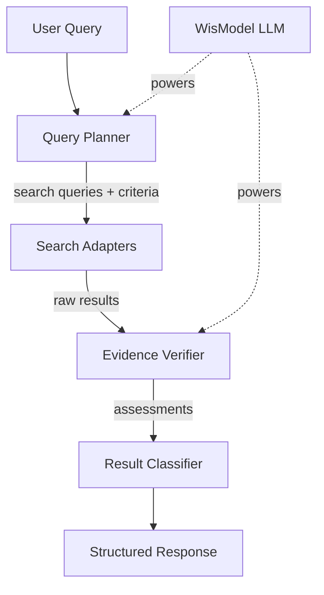
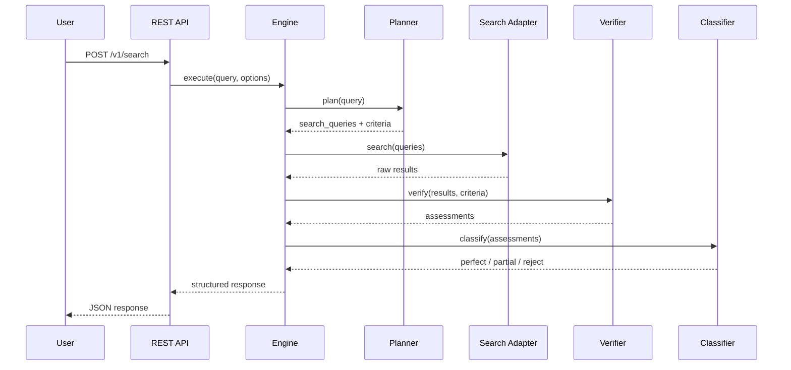

# Architecture

<p align="center">
  
</p>

## Pipeline Overview

OpenSift follows a four-stage pipeline:



### Stage 1: Query Planner

Takes a natural language question and generates via LLM:

- **Search queries** — 2–4 precise keyword phrases for the search backend
- **Screening criteria** — 1–4 quantified rules, each with type, description, and weight

### Stage 2: Search Adapters

Dispatches the generated queries to one or more search backends via the adapter pattern. Results are normalized to a standard schema.

### Stage 3: Evidence Verifier

Verifies each search result against each criterion using the LLM:

| Assessment | Meaning |
|:----------:|---------|
| **Support** | Criterion clearly met, with cited evidence |
| **Somewhat Support** | Partially relevant but not fully met |
| **Reject** | Clearly does not meet the criterion |
| **Insufficient Information** | Not enough info to judge |

### Stage 4: Result Classifier

Automatically classifies based on verification results:

| Classification | Rule |
|:--------------:|------|
| **Perfect** | All criteria are Support |
| **Partial** | At least one non-time criterion is Support or Somewhat Support |
| **Reject** | All criteria are Reject, or only time criteria pass |

## Project Structure

```
opensift/
├── src/opensift/
│   ├── core/                     # Core AI pipeline
│   │   ├── engine.py             # Orchestrator (Plan → Search → Verify → Classify)
│   │   ├── planner/planner.py    # Query planning
│   │   ├── verifier/verifier.py  # Result verification
│   │   ├── classifier.py         # Classification
│   │   └── llm/                  # LLM client + prompt templates
│   ├── adapters/                 # Search backend adapters (pluggable)
│   │   ├── base/                 # Abstract interface
│   │   ├── atomwalker/           # AtomWalker academic search
│   │   ├── elasticsearch/        # Elasticsearch
│   │   ├── opensearch/           # OpenSearch
│   │   ├── solr/                 # Apache Solr
│   │   ├── meilisearch/          # MeiliSearch
│   │   └── wikipedia/            # Wikipedia
│   ├── models/                   # Data models (Pydantic)
│   ├── client/                   # Python SDK
│   ├── api/                      # REST API (FastAPI)
│   ├── config/                   # Config management
│   └── observability/            # Logging
├── tests/
│   ├── unit/                     # Unit tests (mocked)
│   └── integration/              # Integration tests (Docker)
├── deployments/docker/           # Docker Compose files
├── docs/                         # Documentation (this site)
└── pyproject.toml
```

## Data Flow


