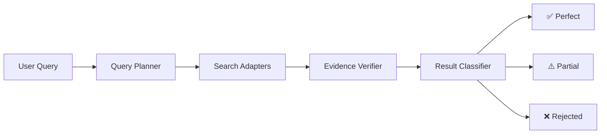

---
hide:
  - navigation
---

  

  
  
  
  
  

# OpenSift

**Open-source AI augmentation layer that adds intelligent query planning and result verification to any search backend.**

OpenSift is born from [WisPaper](https://wispaper.ai), an AI-powered academic search platform developed by Fudan NLP Lab. The core search-verification paradigm — AI query planning + LLM-based result verification — is described in the research paper [*WisPaper: Your AI Scholar Search Engine*](https://arxiv.org/abs/2512.06879).

---

## What is OpenSift?

OpenSift is **not** a search engine or a Q&A system. It is a lightweight AI middleware that plugs into your existing search backend and injects two core AI capabilities:

- :material-brain:{ .lg .middle } **Query Planning**

    ---

    Decomposes natural language questions into precise search queries and quantified screening criteria.

- :material-check-decagram:{ .lg .middle } **Result Verification**

    ---

    Uses LLM to verify each search result against the criteria, with evidence and reasoning.

## How It Works

Traditional search systems return **keyword-matched** results, leaving users to manually read and filter them. OpenSift automatically performs AI-powered filtering after results are returned:

| Classification | Meaning |
|:-:|:--|
| **Perfect** | All criteria fully satisfied |
| **Partial** | Some criteria met, for human review |
| **Rejected** | Filtered out automatically |

## Supported Backends

OpenSift works with any search engine through its adapter pattern:

| Adapter | Backend | Description |
|---------|---------|-------------|
| **AtomWalker** | AtomWalker ScholarSearch | Academic paper search with JCR/CCF metadata |
| **Elasticsearch** | Elasticsearch v8+ | BM25 full-text search + highlighting |
| **OpenSearch** | OpenSearch v2+ | AWS-compatible Elasticsearch fork |
| **Solr** | Apache Solr v8+ | edismax full-text + JSON Request API |
| **MeiliSearch** | MeiliSearch | Instant, typo-tolerant search |
| **Wikipedia** | Wikipedia (all languages) | Multi-language encyclopedia search |

## Quick Links

- :material-rocket-launch: [**Quick Start**](guide/quickstart.md) — Install and run in 5 minutes
- :material-api: [**API Reference**](api/search.md) — REST API documentation
- :material-language-python: [**Python SDK**](sdk.md) — Sync & async client library
- :material-puzzle: [**Adapters**](adapters/overview.md) — Connect any search backend
- :material-cog: [**Configuration**](guide/configuration.md) — YAML + env vars
- :material-github: [**GitHub**](https://github.com/AtomInnoLab/OpenSift) — Source code & issues

